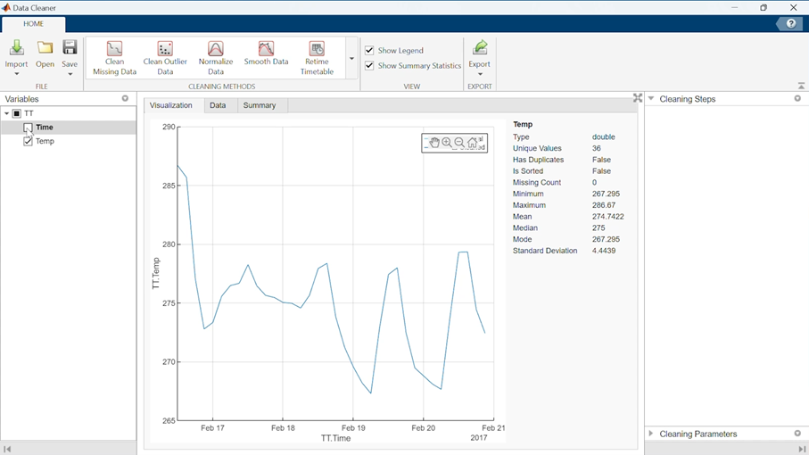
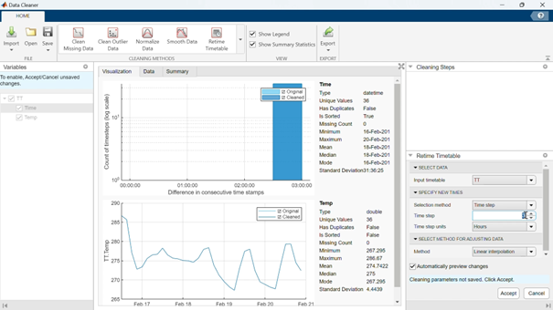
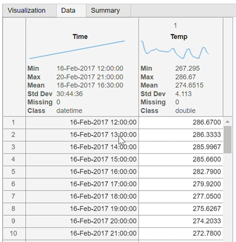
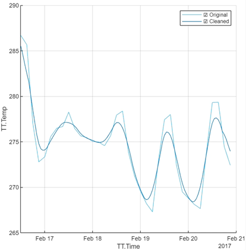
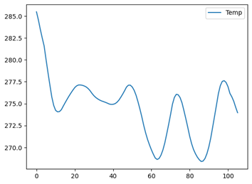
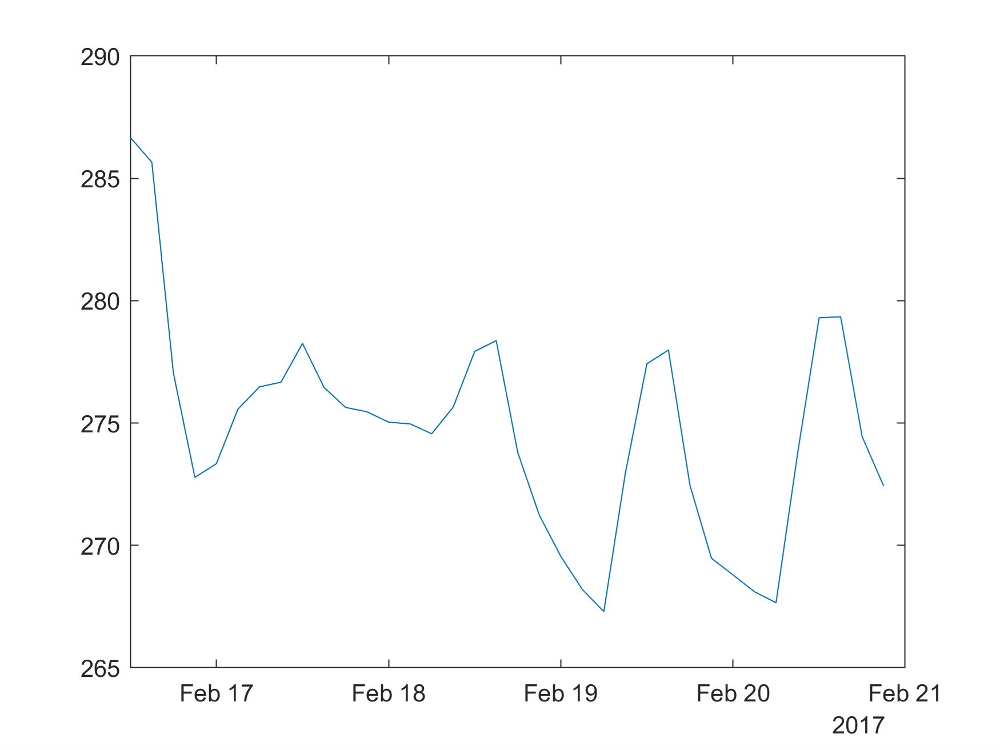
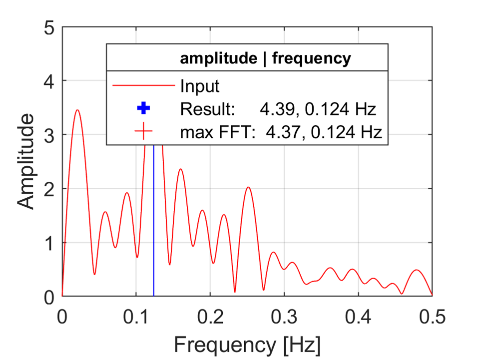
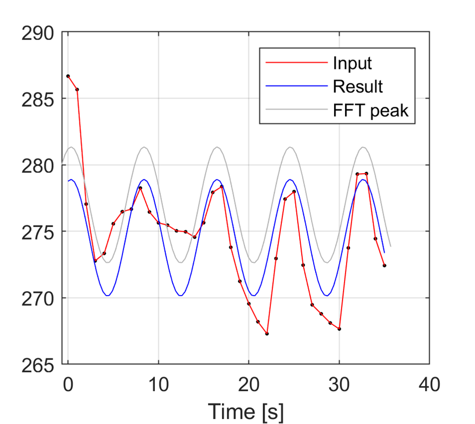
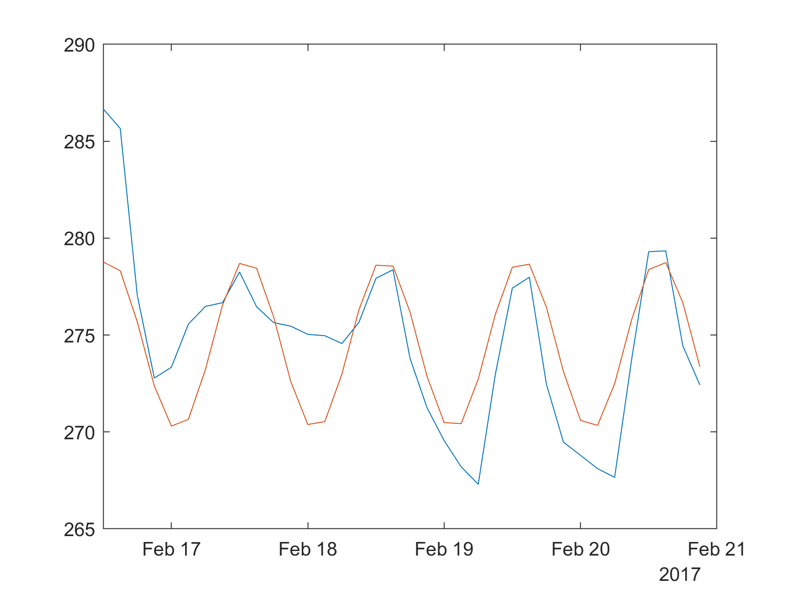
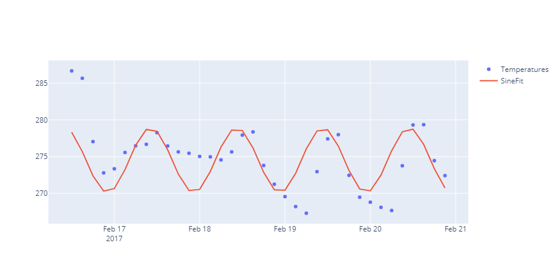

# 6.	Call MATLAB from Python

If you are a Python user and you are wondering why you should consider MATLAB, this chapter is probably a better entry point into this book. One of my favorite colleagues, Lucas Garcia – Deep Learning Product Manager – tried to answer this question at a Python Meetup  in Madrid:
- Facilitate AI development by using MATLAB apps
- Need functionality available in MATLAB (e.g. Simulink)
- Leverage the work from the MATLAB community

But first let’s start with a few basics on how to call MATLAB from Python.

## 6.1.	Getting started with the MATLAB Engine API for Python
First, make sure you have the MATLAB Engine for Python installed (as described in section 3.8).
In your python script or jupyter notebook, the first statement you will need to enter in order to load the MATLAB Engine package is:
```python
>>> import matlab.engine
```
You have then two options to interact with MATLAB from Python:
1.	Start a new session (in batch or interactive)
By default, the engine will be started in batch with the “-nodesktop” mode:
```python
>>> m = matlab.engine.start_matlab()
```

(this is the contextual help provided by VSCode when you enter the function)
If you wish to have the MATLAB Desktop apparent to visualize which values are stored in the workspace or to debug interactively with the console, you can specify the “desktop” argument:
```python
>>> m = matlab.engine.start_matlab("-desktop")
```
2.	Connect to an existing session
First you need to start MATLAB manually. For convenience, it’s easier to have the MATLAB Desktop and your Python development environment (Jupyter or VSCode) open side by side. To share the MATLAB Engine session, simply type inside of MATLAB:
```matlab
>> matlab.engine.shareEngine
```
You can also request the name of the MATLAB Engine session, in case Python doesn’t find it automatically:
```matlab
>> matlab.engine.engineName
ans =
    'MATLAB_11388'
```    
Then on the Python side, enter the following command:
```python
>>> m = matlab.engine.connect_matlab()
```


(this is the contextual help provided by VSCode when you enter the function)
If Python does not find automatically the running session, you can enter the engine name requested previously in MATLAB (`'MATLAB_11388'`).

## 6.2.	Facilitate AI development by using MATLAB Apps

### 6.2.1. Data Cleaner App

The first step in an AI pipeline is often to clean the data. This process requires some level of interactivity for the data analyst to understand which variables she is manipulating. Once the input format of the data is fixed, this process can be automated to scale it to the whole dataset.
Let’s take an example with the weather data from chapter 2. In this first example, we will start MATLAB in `-nodesktop` mode (which is the default mode for the engine). In the next two sections, we will use the `-desktop` mode to show how to use the MATLAB desktop to interact with the data, but also connect to an already running MATLAB session.
Set up the environment
```
!git clone https://github.com/hgorr/weather-matlab-python
```
```python
import matlab.engine
m = matlab.engine.start_matlab()
m.cd('weather-matlab-python') # returns the previous dir location 
# m.cd('..')
```
```text:Output
'C:\\Users\\ydebray\\Downloads\\python-book-github'
```
```python
m.pwd()
```
```text:Output
'C:\\Users\\ydebray\\Downloads\\python-book-github\\weather-matlab-python'
```
```python
# Make sure that your Python interpreter follows along
import os
os.getcwd()
os.chdir('weather-matlab-python')
# os.chdir('..')
```
**Retrieve Weather Data**
```python
import weather
appid ='b1b15e88fa797225412429c1c50c122a1'
json_data = weather.get_forecast('Muenchen','DE',appid,api='samples')
data = weather.parse_forecast_json(json_data)
data.keys()
```
```text:Output
dict_keys(['current_time', 'temp', 'deg', 'speed', 'humidity', 'pressure'])
print(len(data['temp']))
data['temp'] [0:5]
```
```text:Output
36
[286.67, 285.66, 277.05, 272.78, 273.341]
```
```python
t = matlab.double(data['temp'])
t
```
```text:Output
matlab.double([[286.67,285.66,277.05,272.78,273.341,275.568,276.478,276.67,278.253,276.455,275.639,275.459,275.035,274.965,274.562,275.648,277.927,278.367,273.797,271.239,269.553,268.198,267.295,272.956,277.422,277.984,272.459,269.473,268.793,268.106,267.655,273.75,279.302,279.343,274.443,272.424]])
```
**Format into a Timetable**
```python
# Transform into a timetable for data cleaning
m.workspace['data'] = data
m.eval("TT = timetable(datetime(string(data.current_time))',cell2mat(data.temp)','VariableNames',{'Temp'})",nargout=0)
m.who()
```
```text:Output
['TT', 'data']
```
**Interact manually with the app**
```python
m.dataCleaner(nargout=0)
```
The app will appear, with a blank canvas, giving you the option to import data. Select the timetable from your workspace.


 		 
This will open your data into the app main view:


 
In the left panel, you can select the variables that you want to visualize and manipulate. 


We will select the Time variable, and use the **Retime Timetable** cleaning method:


This will display options in the right panel, where we will specify the new sampling, Time step: 1 (hour). Once you are happy with the results, click accept (bottom right).


 
You can see the results of this transformation on your data by changing the tabs in the center panel:


 
The second transformation we will operate on this is **Smooth Data**. 


You can select the smoothing method (we will stick with the default moving average) and play around with the smoothing factor.



**Export the cleaning steps**
Once you are happy with the way your data looks, you can save your manual operations as a function that you will apply to any new weather data that comes in, to automate the preprocessing.

 

[preprocess.m](code/preprocess.m)
```matlab
function TT = preprocess(TT)
	% Retime timetable
	TT = retime(TT,"regular","linear","TimeStep",hours(1));
	% Smooth input data
	TT = smoothdata(TT,"movmean","SmoothingFactor",0.25);
end
```
You can call this function from Python, and test that it works.
```python
TT = m.workspace['TT']
TT2 = m.preprocess(TT)
m.parquetwrite("data.parquet",TT2,nargout=0)
import pandas as pd
pd.read_parquet('data.parquet').plot(y='Temp')
```




### 6.2.2. Regression and Classification Learner Apps
We will take the Boston housing example that is part of the Scikit-Learn sample datasets to call MATLAB from Python. 
Open a Jupyter notebook and connect to a running MATLAB session from Python:
```python
import matlab.engine
m = matlab.engine.connect_matlab()
```
Retrieve the dataset
```python
import sklearn.datasets
dataset = sklearn.datasets.load_boston()
dataset.keys()
```
```text
dict_keys(['data', 'target', 'feature_names', 'DESCR', 'filename', 'data_module'])
```
```python
data = dataset['data']
target = dataset['target']
```
Depending on the version of MATLAB you are you using, you might require converting the data and target arrays to MATLAB double:
-	Before 22a, Numpy arrays were not accepted, so you need to translate them to lists.
-	In 22a, Numpy arrays can be passed into MATLAB object constructor (double, int32, …).
-	From 22b, Numpy arrays can be passed directly into MATLAB functions.

```python
# Before 22a
X_m = matlab.double(data.tolist())
Y_m = matlab.double(target.tolist())
# In 22a
X_m = matlab.double(data)
Y_m = matlab.double(target)
# From 22b
X_m = data
Y_m = target
# Call the regression learner app with data coming from Python
m.regressionLearner(X_m,Y_m,nargout=0)
```
The session is automatically created in the Regression Learner, with the passed data:


You have several models and categories to choose from:


You can visualize certain indicators during the training:


Once you are happy with one of the models you’ve trained, you can generate a function or export it:


Informations are shared in the MATLAB Command Window: 

Variables have been created in the base workspace. Structure 'trainedModel' exported from Regression Learner. 
To make predictions on a new predictor column matrix, X: 
    yfit = trainedModel.predictFcn(X) 
For more information, see [How to predict using an exported model](https://www.mathworks.com/help/stats/export-regression-model-to-predict-new-data.html).


Finally, you can retrieve the model to assign the prediction function to a variable in Python:
```python
model = m.workspace['trainedModel']
m.fieldnames(model)
```
```text
['predictFcn', 'RegressionTree', 'About', 'HowToPredict']
```
```python
predFcn = model.get('predictFcn')
```
This way, you can test the model directly from within Python:
```python
X_test = data[0]
y_test = target[0]
X_test,y_test
```
```text
(array([6.320e-03, 1.800e+01, 2.310e+00, 0.000e+00, 5.380e-01, 6.575e+00,
        6.520e+01, 4.090e+00, 1.000e+00, 2.960e+02, 1.530e+01, 3.969e+02,
        4.980e+00]),
 24.0)
```
```python
m.feval(predFcn,X_test)
```
```text
23.46666666666667
```

You can iterate and test another model to see if the predictions are closer to the test target.

### 6.2.3.	Image Labeler App
Data preparation is key in developing Machine Learning and Deep Learning applications. No matter how much effort you put into your ML model, it will likely perform poorly if you didn’t spend the right time in preparing your data to be consumed by your model.
In this example, we start with a set of images to label for a Deep Learning application.
```python
import os
cwd = os.getcwd()
vehicleImagesPath = os.path.join(cwd, "..", "images", "vehicles", "subset")
```
We then start the MATLAB Engine API for Python and open the Image Labeler App, passing the location of the images as an input:
```python
import matlab.engine
m = matlab.engine.connect()
m.imageLabeler(vehicleImagesPath, nargout=0)
```


*Note that because the App returns no output arguments back to Python, you need to specify `nargout=0` (number of output arguments equals 0).*

Now you can interactively create a new ROI Label:


and start to manually label your vehicles:


This process is rather tedious, especially considering that the number of required labeled images for the problem might be significant for Deep Learning workflows. Thus, the following shows how to facilitate labeling by automating (or semi-automating) the labeling process. After selecting the images you would like to automatically label, you can choose among various algorithms (*ACF vehicle detector, ACF people detector*, or import your custom detector). In this particular case, after choosing *ACF vehicle detector*, the selected images are automatically labeled. Earlier I mentioned that the process is semi-automated, as it might not detect all vehicles, or you might want to correct some bounding boxes before exporting your results.


Finally, export your labeling process as a MATLAB table to continue your work back in Python:


 
Back in Python, gather the variables you are interested in:
```python
imageFilename = m.eval("gTruth.imageFilename")
labels = m.eval("gTruth.vehicle")
```
and put them into a convenient form to continue your work:
```python
import pandas as pd
import numpy as np
# Bring data to convenient form as DataFrame
labels = [np.array(x) for x in labels]
df = pd.DataFrame({"imageFileName":imageFilename, "vehicle":labels})
```
Labeled data is now conveniently shaped into a DataFrame with information regarding file location and bounding boxes for each vehicle, and can be easily accessed:
```python
df.iloc[[13]]
m.exit()
```

## 6.3. Leverage the work from the MATLAB community


MATLAB has a vibrant and established community. It is actually quite
complementary to the Python community, that is younger and growing fast
in particular in areas related to Machine/Deep Learning. [MATLAB File
Exchange](https://www.mathworks.com/matlabcentral/fileexchange/) enables
you to share your own files or browse and download files contributed by
other users. It does not require you to use source control with Git, but
can be connected with your code repositories on GitHub if you want to.
This enables to access community contributions directly from MATLAB via
the add-on manager.


In this example, we will use a MATLAB community toolbox to fit a sine
function over weather data.


#### Set-up the environment


``` python
!git clone https://github.com/hgorr/weather-matlab-python
```


``` python
# download the zip file and unzip it
url_zip = 'https://www.mathworks.com/matlabcentral/mlc-downloads/downloads/a1ca242b-82c2-4a89-b280-38d2243276da/4d399976-e76f-418a-a227-c97d2f7a85f7/packages/zip'

import requests, zipfile, io, os
r = requests.get(url_zip)
z = zipfile.ZipFile(io.BytesIO(r.content))
os.makedirs('sineFit', exist_ok=True)
z.extractall('sineFit')
```


#### Retrieve weather data


``` python
import os
os.chdir('weather-matlab-python')
```


We will use the sample dataset from the forecast in Munich.


``` python
import weather
appid ='b1b15e88fa797225412429c1c50c122a1'
json_data = weather.get_forecast('Muenchen','DE',appid,api='samples')
data = weather.parse_forecast_json(json_data)
```


The MATLAB engine is going to start in the current directory of the
Python interpreter.


``` python
import matlab.engine
m = matlab.engine.connect_matlab()
```


``` python
m.pwd()
```

 {.output .execute_result execution_count="15"}
    'C:\\Users\\ydebray\\Downloads\\python-book-github\\code\\weather-matlab-python'


``` python
m.desktop(nargout=0)
```


Let's convert the data into MATLAB datatypes (datetime and double
precision floats).


``` python
dt = m.datetime(data['current_time'])
temp = matlab.double(data['temp'])
m.plot(dt,temp)
m.print(m.tempdir()+"myPlot.png",'-dpng','-r300',nargout=0)
```


``` python
from IPython.display import Image
Image(m.tempdir()+"myPlot.png")
```




You can create a function to simplify the process of saving MATLAB plots
in your notebook.


``` python
from IPython.display import Image
def mplot(x,y):
    m.plot(x,y)
    m.print(m.tempdir()+"myPlot.png",'-dpng','-r300',nargout=0)
    return Image(m.tempdir()+"myPlot.png")
# mplot(dt,temp)
```


#### Sine Fitting

``` python
# Retrieve description from the webpage https://www.mathworks.com/matlabcentral/fileexchange/66793-sine-fitting
import requests
from bs4 import BeautifulSoup
from IPython.display import HTML
url = 'https://www.mathworks.com/matlabcentral/fileexchange/66793-sine-fitting'
r = requests.get(url)
soup = BeautifulSoup(r.text, 'html.parser')
description = soup.find('div', id='description')#.get_text()
HTML(str(description))
```

    sineFit is a function to detect the parameters of a noisy sine curve, even less than one period long.
    It requires only x and y values and no additional parameters as input.
    No toolbox required
    It is tested with R2016a and R2020a.
    The mean calculation time is on my PC 13 ms with a maximum of 2400 ms.
    Syntax:
    [SineParams]=sineFit(x,y,optional)
    optional: plot graphics if ommited. Do not plot if 0
    Input:
    x and y values, y = offs + amp * sin(2pi * f * x + phi) + noise
    x and y may be row or column vectors
    x may be not equidistant
    Output:
    SineParams(1):offset (offs)
    SineParams(2): amplitude (amp)
    SineParams(3): frequency (f)
    SineParams(4): phaseshift (phi)
    SineParams(5): MSE , if negative then SineParams are from FFT
    Method:
    This is a brief and not exact description of the program flow.
    Resample x, y if samples are not equidistant
    Estimate the offset by the mean of all y values.
    Build the FFT with heavy zero padding.
    Take the frequency, amplitude and phase of the largest FFT peak.If the frequency is at the Nyquist limit or the period is less than one, add extra frequencies for evaluation. Add also frequencies that have a peak value larger than 0.8 of the max. peak.
    Take those values as initial values for the regressions.
    Exclude results above Nyquist frequency.
    Take the resulting MSE as rating.
    Depending on the number of samples and the MSE, set a limit for accepted amplitude in relation to the FFT amplitude.
    If the amplitude from regression is higher than the accepted amplitude, take the FFT parameters.
    A demonstration GUI is included.
    Suplement:
    A second version, sinFit2, that has the confidence intervals as output, is included. This version requires the 'curve fitting toolbox'. The results are in nearly all cases the same as with the regular sinFit. But the process time is 10 times higher.
    For more information read the enclosed pdf.


``` python
m.cd('..')
m.cd('sineFit/')
```

    'C:\\Users\\ydebray\\Downloads\\python-book-github\\code'


``` python
t = matlab.double(range(36))
SineParams = m.sineFit(t,temp)
SineParams
```

    matlab.double([[274.51842044220115,4.390270295890297,0.12378139169121775,1.3187000578012196,9.61367024285807]])


``` python
m.print(m.tempdir()+"fft.png",'-dpng','-r300',nargout=0)
m.close(m.gcf()) # close the current figure
Image(m.tempdir()+"fft.png")
```




``` python
m.print(m.tempdir()+"sine.png",'-dpng','-r300',nargout=0)
m.close(m.gcf())
Image(m.tempdir()+"sine.png")
```




#### Sine Fit 2: retrieve the values of the sine model

Create a function in MATLAB that returns the values of the sine model
for a given set of parameters and a given set of x values.


``` python
m.edit('sineFit2.m',nargout=0)
```


``` matlab
function Sine=sineFit2(y)
    s = size(y);
    if s(1)>s(2)
        y = y';
    end
    n=length(y);
    x = linspace(1,n,n);
    SineP = sineFit(x,y,0); % does not generate plots
    Sine = SineP(1)+SineP(2)*sin(2*pi*SineP(3)*x+SineP(4));
end
```

``` python
mat_temp = matlab.double(temp)
SineVal = m.sineFit2(mat_temp)[0]
SineVal
```

    matlab.double([278.76990973043,278.3159918142903,275.67845197258595,272.3738730375523,270.3023846684254,270.65509065371265,273.22918539644996,276.5445669343253,278.6948941220223,278.44373092737726,275.9354959419373,272.6124218319101,270.38527296408427,270.5346577616464,272.9746801119398,276.3023295473256,278.60421089340406,278.55674462500303,276.187223800081,272.85812057806464,270.4836660592461,270.4291692722226,272.72596581629216,276.05339992247,278.4982002304407,278.6546089515687,276.432691224009,273.11004757040575,270.59719484552426,270.33902091123986,272.48397552754307,275.7987118855729,278.37725981779397,278.7369567822915,276.67097737588534,273.3672577389005])


``` python
m.plot(dt,temp,dt,SineVal)
m.print(m.tempdir()+"sine2.png",'-dpng','-r300',nargout=0)
m.close(m.gcf())
Image(m.tempdir()+"sine2.png")
```




``` python
m.quit()
```


#### Sine Fit 2: retrieve only the parameters

This second implementation does a minimal work from the MATLAB side, of
fitting the parameters *(a,b,c,d)* of the Sine model:

$a + b * \sin(2*\pi*c + d)$


``` python
# need to grab the first element of the matlab double array, to return a list
SineP = SineParams[0]
SineP
```

    matlab.double([274.51842044220115,4.390270295890297,0.12378139169121775,1.3187000578012196,9.61367024285807])


``` python
from math import sin,pi 
# SineP(1)+SineP(2)*sin(2*pi*SineP(3)*tt+SineP(4)));
def Sine(t):
    return SineP[0]+SineP[1]*sin(2*pi*SineP[2]*t+SineP[3])
```


``` python
# generate a list from 1 to 40
t = list(range(1,41))
Sine(t[0])
```

    278.3160060160971


``` python
# need to use the concept of list comprehension in Python to generate a list of Sine values
SineFit = [ Sine(x) for x in t ]
SineFit
```

    [278.3160060160971,
     275.67847973668944,
     272.3739196764843,
     270.3024469769646,
     270.65515788048975,
     273.2292437128614,
     276.544605816173,
     278.69491187707507,
     278.4437364917198,
     275.93550543880036,
     272.6124508958369,
     270.3853283268998,
     270.53473260719556,
     272.9747563159341,
     276.3023864800646,
     278.6042366545825,
     278.5567436112691,
     276.1872158371935,
     272.85813116202854,
     270.4837123742306,
     270.4292496350409,
     272.7260590047737,
     276.0534757165994,
     278.4982360605309,
     278.6546034995617,
     276.432666798511,
     273.11003895995225,
     270.5972300930384,
     270.3391046170991,
     272.48408461103503,
     275.79880715806433,
     278.37730768952696,
     278.73694909673236,
     276.670937667739,
     273.3672294158298,
     270.72545569294766,
     270.2646356757483,
     272.24974074957385,
     275.539336033496,
     278.2419051283501]


``` python
import plotly.graph_objects as go
fig = go.Figure()
fig.add_trace(go.Scatter(x=data['current_time'], y=data['temp'],
                    mode='markers',
                    name='Temperatures'))
fig.add_trace(go.Scatter(x=data['current_time'], y=SineFit,
                    mode='lines',
                    name='SineFit'))

fig.show()
```




A recorded demo of this chapter can be found here:
- Part 1:
https://github.com/yanndebray/matlab-with-python-book/assets/128002745/dc9b069e-bf73-4294-aa1d-79813df9c62d
- Part 2:
https://github.com/yanndebray/matlab-with-python-book/assets/128002745/6b777298-76ea-405e-b3ee-57fa5a18e211
